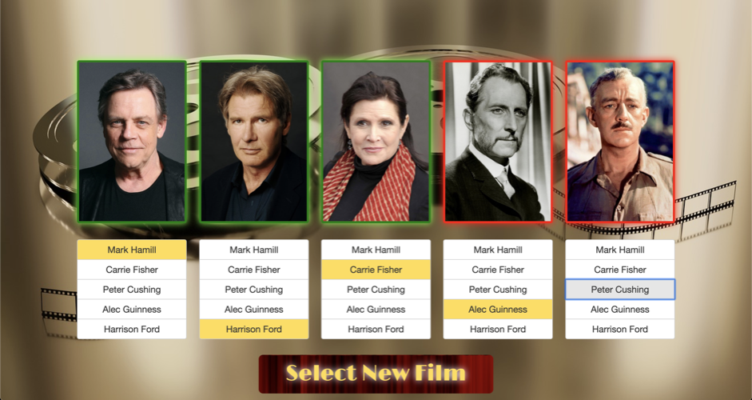

# React Movie Challenge

## Overview

"Who's In It?" is a movie cast matching game built by [Nathan Burgess](https://nb28vt.github.io/) in 2017 as a simple challenge while learning React.js.

Players search for a movie by title, select from the search results, and are presented with five cast member headshots. They must match each image to a scrambled list of names to win the game. Movie data is retrieved from [The Movie Database API](https://www.themoviedb.org/documentation/api).

You can play the game yourself [here](https://whos-init.herokuapp.com/).

